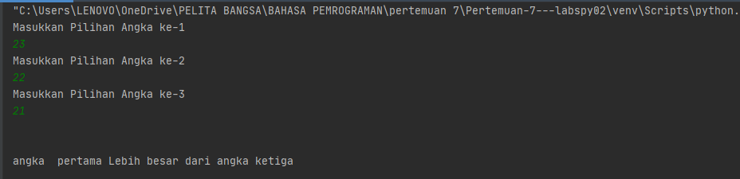
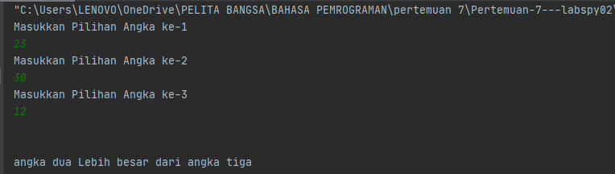
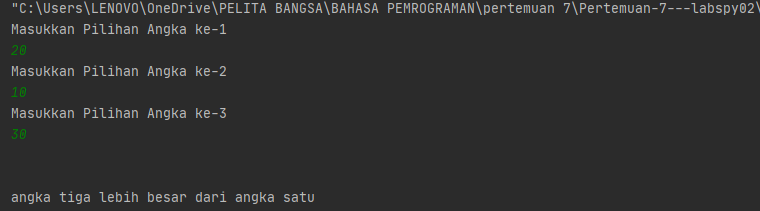
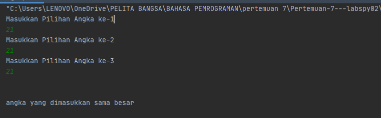

# Pertemuan-7---labspy02
Repository ini dibuat untuk memenuhi tugas pertemuan 7 Bahasa Pemprograman (Modul Praktikum 2) - Teknik Informatika

NAMA    : BAGUS TRIARSA<br>
NIM     : 312010202<br>
KELAS   :TI.20.B.1<br><br>


### menentukan bilangan Terbesar dari 3 Nilai yang diinputkan 

<br><br>
Pada pertemuan ke -7 saya mendapat tugas dari Dosen Bahasa Pemprograman Teknik Informatika Bapak Agung Nugroho,S.kOM.,M.KOM 
Untuk membuat aplikasi yang menentukan bilangan terbesar dari tiga nilai yang client/user inputan menggunakan Bahasa Pemprograman.

<br>


<br>

Pada repository ini saya akan menjelaskan alur dalam *flowchart* yang telah saya buat. file *flowchart*  bisa dilihat pada link berikut ini :

<br>

Berikut souce code yang saya tulis untuk menjadikan aplikasi tersebut ([labspy02](tugas_pr2.py)) : 
<br>

```python
print("Masukkan Pilihan Angka ke-1")
bilangan1 = int(input())
print("Masukkan Pilihan Angka ke-2")
bilangan2 = int(input())
print("Masukkan Pilihan Angka ke-3")
bilangan3 = int(input())

```
berikut contoh (angka 1> angka2) dan (angka1 >angka3) :<br>
dengan source code :
``` python

if (bilangan1 > bilangan2) and (bilangan1 > bilangan3):
    print(f"angka  pertama Lebih besar dari angka ketiga")
```
Dari source code tersebut akkan menghasilkan output :
<br>

<br>
*ket* : <br>
Kondisi ***if*** digunakan untuk mengeksekusi kode jika kondisi bernilai benar,True.
<br>
dan jika (angka 2>angka 1)  dan (angka2 > angka3) :
dengan source code :
<br>
```python

if (bilangan1 > bilangan2) and (bilangan1 > bilangan3):
    print(f"angka  pertama Lebih besar dari angka ketiga")
```
Dari source code tersebut akan menghasilkan output :

<br>
<br>
selanjutnya jika (angka 3> bilangan1) dan (angka3>angka2) dengan source code/syntax :
<br>
```python

elif (bilangan2 > bilangan1) and (bilangan2 > bilangan3):
    print(f"angka dua Lebih besar dari angka tiga")
```
Dari source code tersebut akan menghasilkan output :


*ket :
<br>
Pengambilan keputusan **(kondisi if elif)** merupakan lanjutan/percabangan logika dari 
***kondisi if***. Dengan elif kita bisa membuat kode program yang akan menyeleksi beberapa kemungkinan yang bisa terjadi.

jika semua bilangan bernilai sama kita akan menggunakan kondisi ***els*** dengan source code berikut : <br>
```python
else :
    print("Semua angka sama besarnya")
```
<br>
Dari syntax tersebut akan menghasilkan output : <br>
 


<br><br>
* Ket : 
<br>
***kondisi if else*** adalah kondisi dimana jika pertanyaan benar *True*, maka code didalam if akan dieksekusi, tetapi jika bernilai salah *False* maka akan mengeksekusi kode didalam else.
### ***=====tank you ============
######### ***tugas praktikum 2_modul 2***=====
#######====***Repository_labspy02======***
######====*** BAGUS TRIARSA - 312010202====***

