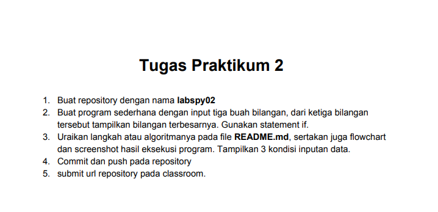

# Pertemuan-7---labspy02
Repository ini dibuat untuk memenuhi tugas pertemuan 7 Bahasa Pemprograman (Modul Praktikum 2) - Teknik Informatika

NAMA    : BAGUS TRIARSA 
NIM     : 312010202 
KELAS   :TI.20.B.1  

### menentukan bilangan Terbesar dari 3 Nilai yang diinputkan 

  
Pada pertemuan ke -7 saya mendapat tugas dari Dosen Bahasa Pemprograman Teknik Informatika Bapak Agung Nugroho,S.kOM.,M.KOM 
Untuk membuat aplikasi yang menentukan bilangan terbesar dari tiga nilai yang client/user inputan menggunakan Bahasa Pemprograman.

 

 

Pada repository ini saya akan menjelaskan alur dalam *flowchart* yang telah saya buat. file *flowchart*  bisa dilihat pada link berikut ini :

 

Berikut souce
